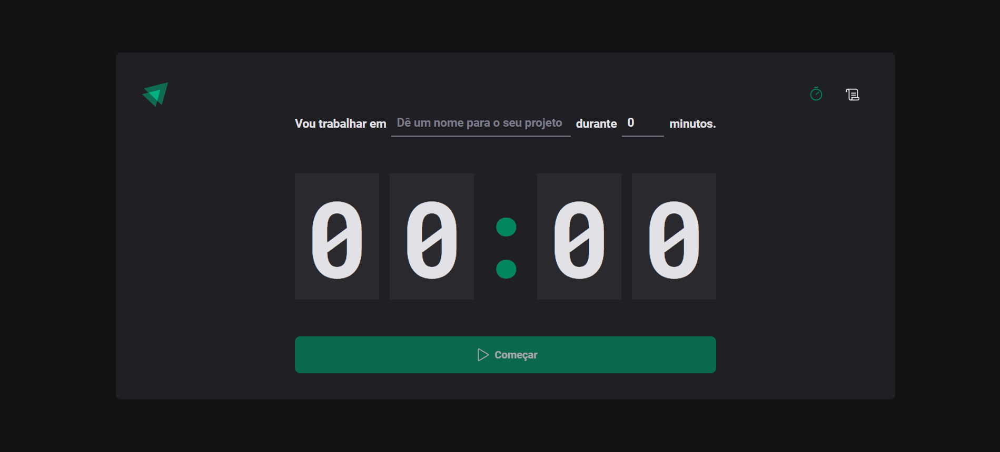
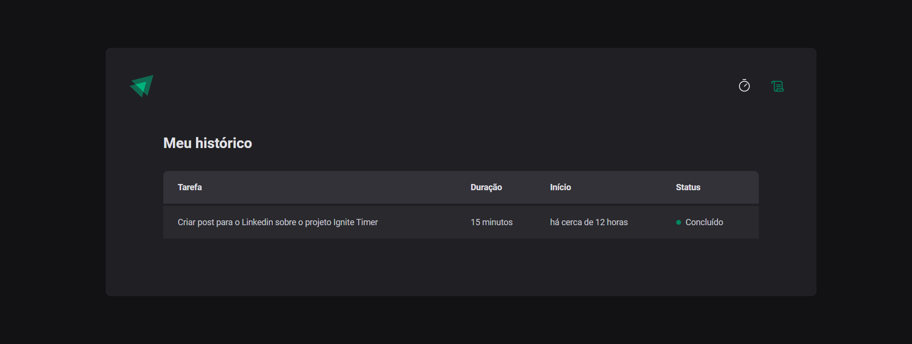

# Ignite Timer (projeto 02) - Bootcamp Ignite - RocketSeat
### Home

### History

> SPAs com ReactJS - Trilha 2022

Projeto desenvolvido durante o módulo 2 do curso.

## 🔧 Tecnologias
- ReactJS
- TypeScript
- HTML
- CSS
- Git e Github
- Vite

## 📖 Bibliotecas
- React Router DOM
- React Hook Form
- Immer
- Styled Components

## ✉️ Contato
lauro.almeida@uniriotec.br
